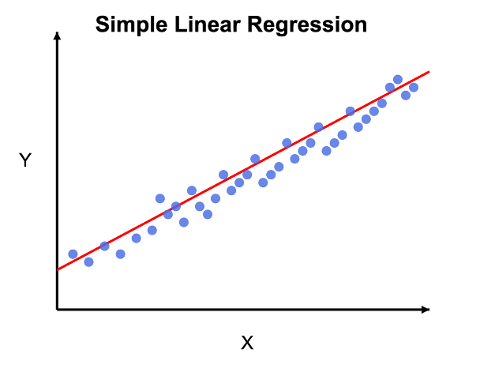
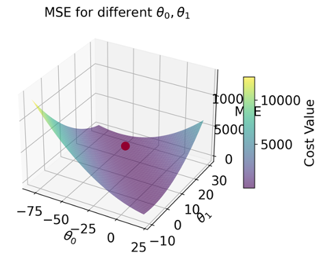
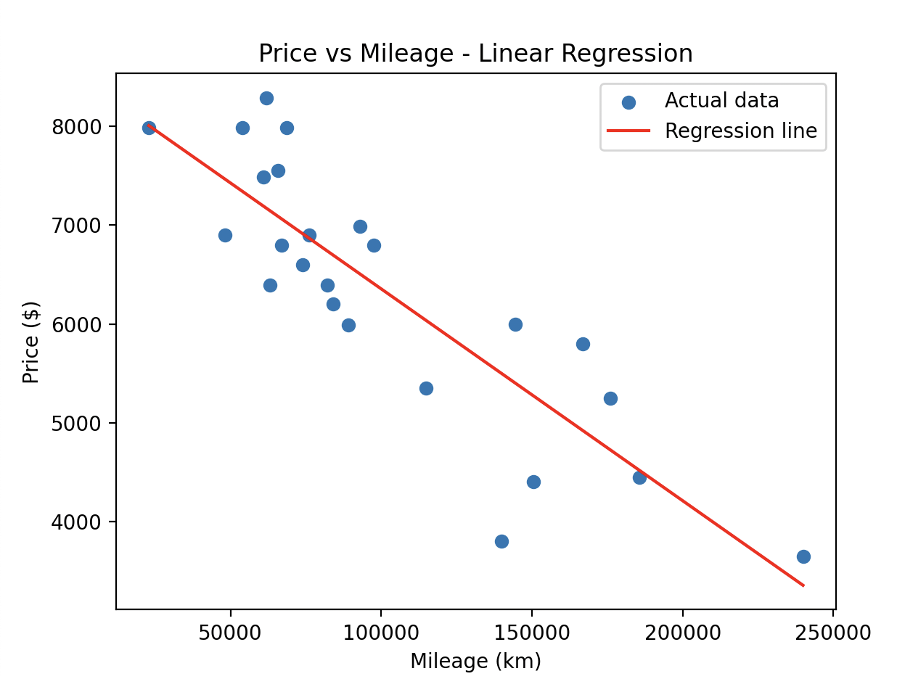
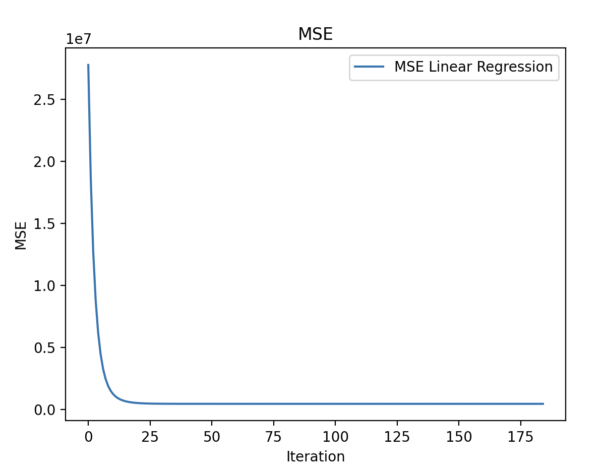

## Overview
This project implements linear regression from scratch to predict car prices based on mileage. The goal is to understand basic machine learning concepts, such as mean squared error and gradient descent, without using machine learning libraries.

## Concepts

### Linear Regression
Linear regression finds the best-fit straight line for a given dataset. The prediction model is:

 Predicted price = θ0 + θ1 × mileage 

Where:
- θ0 is the y-intercept
- θ1 is the gradient of the slope

This is equivalent to the standard linear equation y = mx + c.

### Loss Function: Mean Squared Error (MSE)
The loss function measures how well the straight line fits the data. MSE represents the average squared difference between the predicted and actual values:

MSE = (1/m) × Σ (prediction - actual)²

Where m is the number of data points in the dataset.

Substituting our linear equation:

MSE = (1/m) × Σ (θ0 + θ1 × mileage - actual)²

The goal is to find the values of θ0 and θ1 that minimize MSE.

### Visualizing MSE in 3D

The minimum point on this surface represents the optimal values for our parameters.

### Finding the Minimum: Partial Derivatives
To find the minimum point of the MSE surface, we find the partial derivatives with respect to both parameters:

- **∂MSE/∂θ0**: The slope of the surface when moving only in the θ0 direction
- **∂MSE/∂θ1**: The slope of the surface when moving only in the θ1 direction

At the minimum point, both partial derivatives equal zero (the gradient is flat).

The partial derivatives are:

∂MSE/∂θ0 = learningRate * (1/m) × Σ (predicted - actual)

∂MSE/∂θ1 = learningRate * (1/m) × Σ (predicted - actual) × mileage

Where learningRate is a constant thats later used in gradient descent to optimise step distance

### Gradient Descent Algorithm
Gradient descent is an iterative optimization algorithm that finds the θ0 and θ1 that gives the minimum of the MSE function:

1. Start with initial parameter values
2. For each iteration, update the parameters:
   - θ0 = θ0 - learningRate × (∂MSE/∂θ0)
   - θ1 = θ1 - learningRate × (∂MSE/∂θ1)

**Why this works:**
- When we're on the left of the minimum point, the gradient is negative, so subtracting it moves us right (toward the minimum)
- When we're on the right of the minimum point, the gradient is positive, so subtracting it moves us left (toward the minimum)
- The magnitude of the gradient is larger when we're farther from the minimum, so we take bigger steps when far away and smaller steps as we approach the optimal point

## Results

After training the model using gradient descent, here are the results:

Linear regression results:

  

Mean squared error:

  

